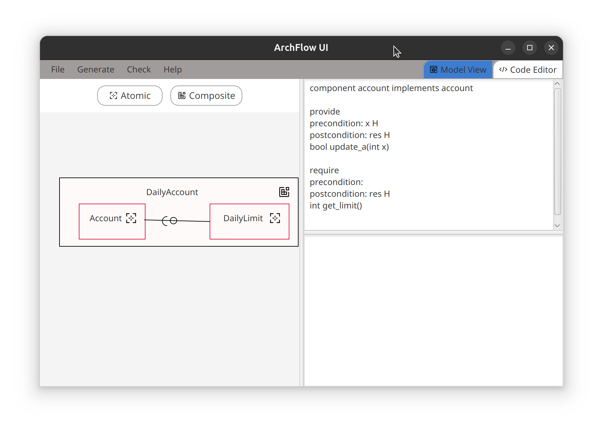

# ArchFlow

> Verify UML compliance with information flow specifications

ArchFlow allows you to build component diagrams along with cidl specifications for each component. ArchFlow can check whether your Diagram is compliant with the specifications. You can also generate Java Classes that correspond to your components and specifications.

## Installation

Clone the repository.
Compile with maven.
Use the maven goal javafx:run to launch.

## Example

Two examples are included in the repository: dailyaccount and travelplanner.
To load an example, choose "File" -> "Load Diagram" and navigate to the corresponding .json file. eg .../ArchFlow/Examples/DailyAccount/DailyAccount.json
You can select components and use "File" -> "Load spec" to set the cidl specifications for each Component manually.
Use "Generate" -> "Generate Java" to generate corresponding Java Code. Note that the generated Java Code may not run, eg. if you have used unknown types in your spec files.

## Licence

ArchFlow is available under the MIT Licence. See the LICENSE file for more details.
